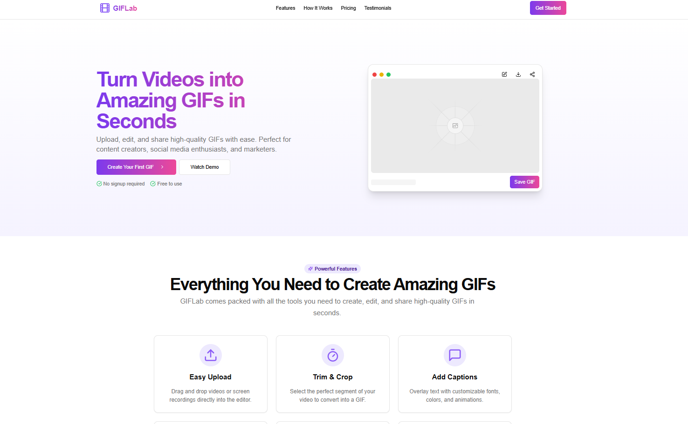
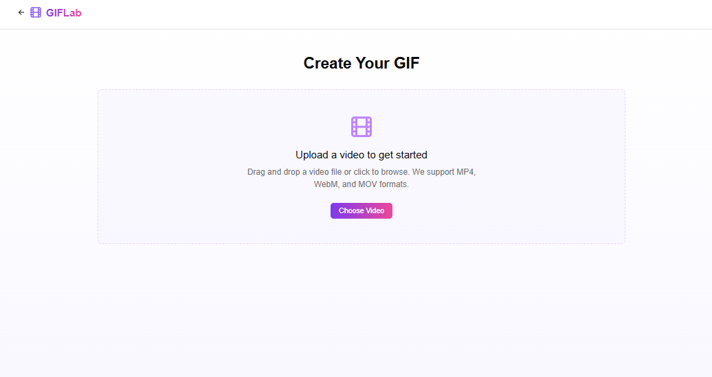
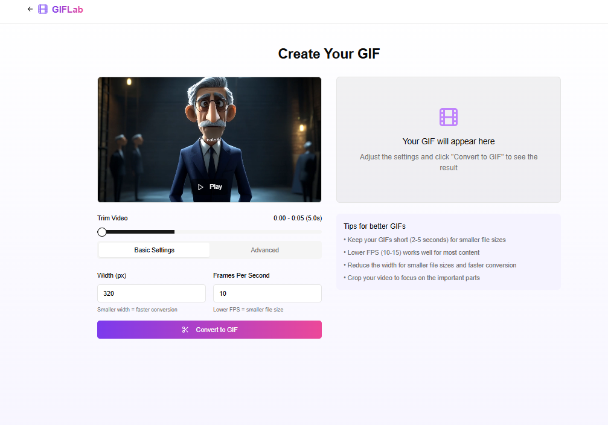

# GifByHassan

Simple and personal. Easy to brand.

## About

GifByHassan is a modern web application for creating and managing GIFs with a personal touch. Built with Next.js and styled with Tailwind CSS, it offers a seamless user experience for GIF creation and management.

## Author

Created by Hassan

## Tech Stack

- Next.js
- TypeScript
- Tailwind CSS
- Shadcn UI Components

## Getting Started

1. Clone the repository
2. Install dependencies:
```bash
npm install
# or
pnpm install
```

3. Run the development server:
```bash
npm run dev
# or
pnpm dev
```

4. Open [http://localhost:3000](http://localhost:3000) with your browser to see the result.

## Features

- Modern UI with Shadcn components
- Responsive design
- Dark mode support
- GIF creation and management tools

## Screenshots







## License

MIT License